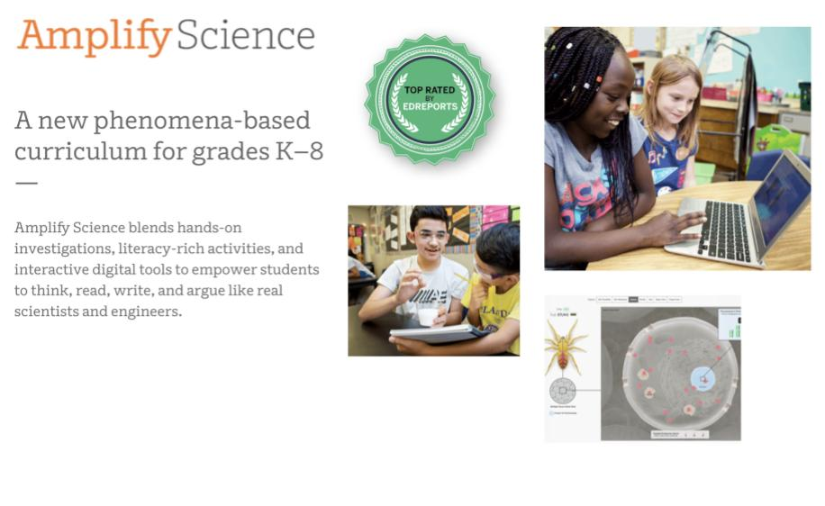
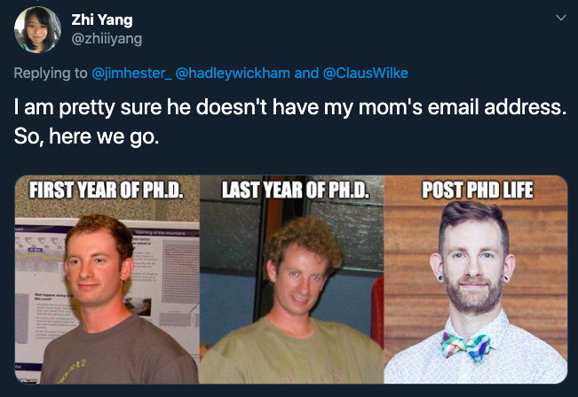
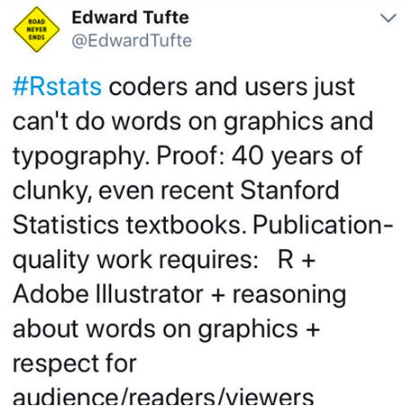
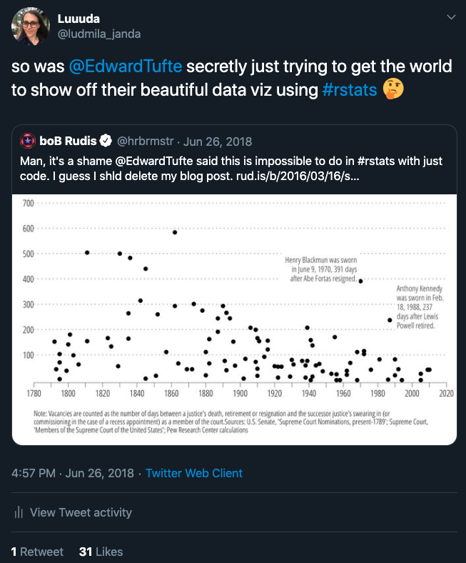
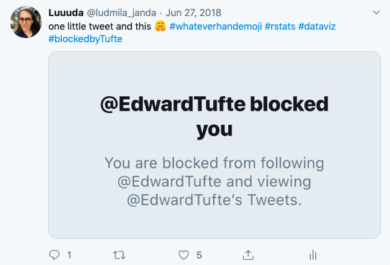
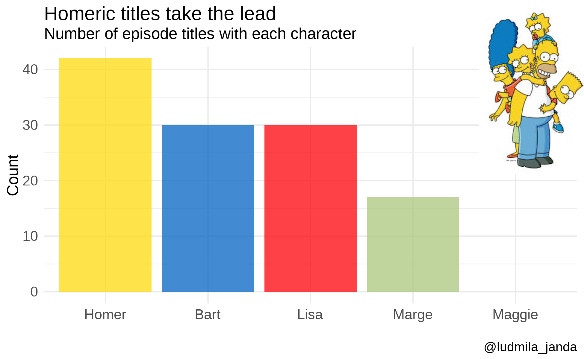
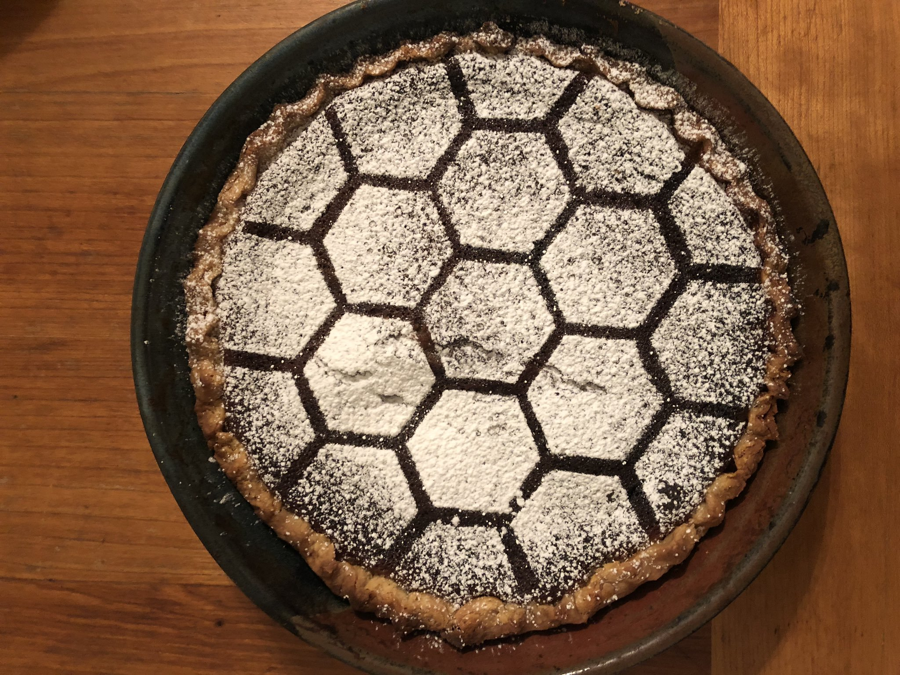

```{r setup, include=FALSE, warning=FALSE, message=FALSE}
options(htmltools.dir.version = FALSE)
library(tidyverse)
library(scales)
library(ggridges)
library(gghighlight)
library(extrafont)
library(ggforce)
library(cowplot)
library(tvthemes)
library(ggpointdensity)
knitr::opts_chunk$set(warning = FALSE, message = FALSE, dpi = 150)
```

# Amplify



---

[Glow-up definition](https://twitter.com/zhiiiyang/status/1135743078881304576)



---

### Motivation



---

### Motivation



---

### Motivation



---

### Motivation

- One of the great powers of R is visualization

--

- Yet graphs like this persist 

```{r bad_graph, echo=FALSE, fig.width=6.5, fig.asp=0.618}
data(diamonds)

ggplot(diamonds, aes(factor(cut), price)) + 
  geom_boxplot() +
  labs(title = "Diamond Prices By Cut")
```

---

```{r theme, echo=TRUE, fig.height=5, fig.width=7}
ggplot(diamonds, aes(factor(cut), price)) + 
  geom_boxplot() +
  labs(title = "Diamond Prices By Cut") +
  theme_minimal()
```

---

### Make your own theme!
```{r theme_diamonds}
theme_diamonds <- function(x) {
  theme(text = element_text(family = "Luminari"),
        axis.text = element_text(size = 10, color = "skyblue"),
        axis.title.x = 
          element_text(size = 12, color = "skyblue", vjust = -3),
        axis.title.y = 
          element_text(size = 12, color = "skyblue", vjust = 6),
        axis.line.x = element_line(color  = "gold"), 
        axis.line.y = element_line(color  = "gold"), 
        axis.ticks = element_line(color  = "gold"),
        plot.title = 
          element_text(size = 14, face = "bold", color = "skyblue"),
        plot.caption = element_text(color = "skyblue"),
        plot.margin = margin(t = 0.5, r = 0.5, b = 0.5, l = 0.5, "cm"),
        panel.background = element_rect(fill = "white"),
        panel.grid.minor = element_blank())
}
```

---

```{r use_theme_diamonds, echo=FALSE, fig.width=6, fig.asp=0.618}
ggplot(diamonds, aes(factor(cut), price)) + 
  geom_boxplot() +
  labs(title = "Diamond Prices By Cut") +
  theme_diamonds()
```

---

```{r scales, echo=TRUE, message=FALSE, fig.width=6.5, fig.asp=0.618}
library(scales)
ggplot(diamonds, aes(cut, price)) + 
  geom_boxplot() +
  scale_y_continuous(label = comma) +
  labs(x = "Cut", y = "Price", title = "Diamond Prices By Cut") +
  theme_diamonds()
```

---

```{r dotplot, echo=TRUE, message=FALSE, fig.width=6.5, fig.asp=0.618}
ggplot(diamonds, aes(cut, price)) + 
  geom_dotplot(binaxis = "y", stackdir = "center", stackratio = 0.5, 
               dotsize = 0.5, binwidth = 30, alpha = 0.5) +
  scale_y_continuous(label = comma) +
  labs(x = "Cut", y = "Price", title = "Diamond Prices By Cut") +
  theme_diamonds() 
```

---

```{r dotploth, echo=TRUE, message=FALSE, fig.width=6.5, fig.asp=0.618}
ggplot(diamonds, aes(cut, price, color = cut)) + 
  geom_dotplot(binaxis = "y", stackdir = "center", stackratio = 0.5, 
               dotsize = 0.5, binwidth = 30, alpha = 0.5) +
  gghighlight::gghighlight(cut == "Ideal") + 
  scale_y_continuous(label = comma) +
  labs(x = "Cut", y = "Price", title = "Diamond Prices By Cut") +
  theme_diamonds() 
```

---

```{r ridgeplot, echo=TRUE, message=FALSE, fig.width=4.5, fig.asp=0.618}
ggplot(diamonds, aes(price, cut)) + 
  ggridges::geom_density_ridges(alpha = 0.5,
                      scale = 1.4,                # ridge height/overlap 
                      rel_min_height = 0.001) +   # where to draw line
  scale_x_continuous(limits = c(0, 22000),        # set cutoff 
                     expand = c(0.01, 0),         # allow expansion
                     label = comma) +       
  scale_y_discrete(expand = c(0.1, 0)) +          # padding around graph 
  labs(x = "Price", y = "Cut", title = "Diamond Prices By Cut") + 
  theme_diamonds() 
```

---

```{r ridgeplotm, echo=TRUE, message=FALSE, fig.width=5, fig.height=3}
ggplot(diamonds, aes(price, cut)) + 
  geom_density_ridges(scale = 1.4, rel_min_height = 0.001, alpha = 0.5,
                                quantile_lines = TRUE, quantiles = 2) +  
  scale_x_continuous(limits = c(0, 22000), 
                     expand = c(0.01, 0), label = comma) +       
  scale_y_discrete(expand = c(0.1, 0)) + 
  labs(x = "Price", y = "Cut", title = "Diamond Prices By Cut") + 
  theme_diamonds()
```

---

```{r ridgeplotv, echo=TRUE, message=FALSE, fig.width=4.5, fig.asp=0.618}
library(viridis)
ggplot(diamonds, aes(price, cut, fill = ..x..)) + 
  geom_density_ridges_gradient(scale = 1.4, rel_min_height = 0.001, 
                               gradient_lwd = 1) +  ## add gradient  
  scale_x_continuous(limits = c(0, 2000), 
                     expand = c(0.01, 0), label = comma) +       
  scale_y_discrete(expand = c(0.1, 0)) + 
  viridis::scale_fill_viridis(name = "Price", option = "D") +
  labs(x = "Price", y = "Cut", title = "Diamond Prices By Cut") + 
  theme_diamonds() 
```

---

```{r ridgeplotvq, echo=TRUE, message=FALSE, fig.width=4.5, fig.asp=0.618}
ggplot(diamonds, aes(price, cut, fill = factor(..quantile..))) + 
  stat_density_ridges(scale = 1.4, rel_min_height = 0.001, 
                      geom = "density_ridges_gradient", calc_ecdf = TRUE, 
                      quantiles = 4, quantile_lines = TRUE) +  
  scale_x_continuous(limits = c(0, 22000), 
                     expand = c(0.01, 0), label = comma) +       
  scale_y_discrete(expand = c(0.1, 0)) + 
  viridis::scale_fill_viridis(discrete = TRUE, name = "Quartiles") +
  labs(x = "Price", y = "Cut", title = "Diamond Prices By Cut") + 
  theme_diamonds() 
```

---

```{r ridgeplotj, echo=TRUE, message=FALSE, fig.width=6, fig.height=2.7, cache=TRUE}
ggplot(diamonds, aes(price, cut)) + 
  geom_density_ridges(scale = 1.4, rel_min_height = 0.001, 
                      alpha = 0.5, size = 0.25, jittered_points = TRUE,  
                      point_shape = "|", point_size = 3, 
                      position = position_jitter(height = 0)) + 
  scale_x_continuous(limits = c(0, 22000), 
                     expand = c(0.01, 0), label = comma) +       
  scale_y_discrete(expand = c(0.1, 0)) + 
  labs(x = "Price", y = "Cut", title = "Diamond Prices By Cut") + 
  theme_diamonds() 
```

---

```{r raincloud, echo=FALSE, message=FALSE, fig.width=12, fig.asp=0.618}
source("https://gist.githubusercontent.com/benmarwick/2a1bb0133ff568cbe28d/raw/fb53bd97121f7f9ce947837ef1a4c65a73bffb3f/geom_flat_violin.R")

lb <- function(x) mean(x) - ((0.5)*sd(x))
ub <- function(x) mean(x) + ((0.5)*sd(x))

sumld <- diamonds %>% 
  group_by(cut) %>% 
  summarise(mean = mean(price), 
            median = median(price), 
            lower = lb(price), 
            upper = ub(price))

ggplot(data = diamonds, aes(y = price, x = cut, fill = cut)) +
  geom_flat_violin(position = position_nudge(x = .2, y = 0), alpha = .8) +
  geom_point(aes(y = price, color = cut), 
             position = position_jitter(width = .15), size = .5, alpha = 0.8) +
  geom_point(data = sumld, aes(x = cut, y = mean), 
             position = position_nudge(x = 0.3), size = 2.5) +
  geom_errorbar(data = sumld, aes(ymin = lower, ymax = upper, y = mean), 
                position = position_nudge(x = 0.3), width = 0) +
  scale_y_continuous(limits = c(0, 22000), 
                     expand = c(0.01, 0), label = comma) + 
  scale_x_discrete(expand = c(0.1, 0)) +
  labs(x = "Cut", y = "Price", title = "Diamond Prices By Cut") + 
  guides(fill = FALSE) +
  guides(color = FALSE) +
  coord_flip() +
  theme_diamonds() +
  theme(axis.text = element_text(size = 20),
        axis.title.x = element_text(size = 25), 
        axis.title.y = element_text(size = 25),
        plot.title = element_text(size = 30), 
        plot.margin = margin(t = 2, r = 2, b = 2, l = 2, "cm"))
```

---

```{r raincloud2, eval=FALSE}
## FROM: https://orchid00.github.io/tidy_raincloudplot
source("see code above")

lb <- function(x) mean(x) - ((0.5)*sd(x))
ub <- function(x) mean(x) + ((0.5)*sd(x))

sumld <- diamonds %>% 
  group_by(cut) %>% 
  summarise(mean = mean(price), 
            median = median(price), 
            lower = lb(price), 
            upper = ub(price))

ggplot(data = diamonds, aes(y = price, x = cut, fill = cut)) +
  geom_flat_violin(position = position_nudge(x = .2, y = 0), alpha = .8) +
  geom_point(aes(y = price, color = cut), 
             position = position_jitter(width = .15), 
             size = .5, alpha = 0.8) +
  geom_point(data = sumld, aes(x = cut, y = mean), 
             position = position_nudge(x = 0.3), size = 2.5) +
  geom_errorbar(data = sumld, aes(ymin = lower, ymax = upper, y = mean), 
                position = position_nudge(x = 0.3), width = 0) +
  scale_y_continuous(limits = c(0, 22000), 
                     expand = c(0.01, 0), label = comma) + 
  scale_x_discrete(expand = c(0.1, 0)) +
  labs(x = "Price", y = "Cut", title = "Diamond Prices By Cut") + 
  guides(fill = FALSE) +
  guides(color = FALSE) +
  coord_flip() +
  theme_diamonds() 
```

---

### TidyTuesday

[Github](https://github.com/rfordatascience/tidytuesday), [Shiny app: tidytuesday.rocks](https://nsgrantham.shinyapps.io/tidytuesdayrocks/)


---
```{r simpsons, warning=FALSE, message=FALSE, eval=FALSE}
plot <- 
  theme_void() + 
  theme(text = element_text(family = "Gaegu"),
        axis.text = element_text(size = 15, color = "white"),
        axis.title = element_text(size = 20, color = "white"),
        plot.title = element_text(size = 25,face = "bold", 
                                  color = "white", hjust = 0.5),
        plot.caption = element_text(color = "white"),
        plot.margin = margin(t = 1, r = 3, b = 1, l = 1, "cm"),
        axis.title.y = element_text(angle = 90))

ggimage::ggbackground(plot, "chalkboard_simpsons.gif", by = "height")
```

```{r simpsons2, echo=FALSE, warning=FALSE, message=FALSE, fig.height=3, fig.width=6}
## TAKEN FROM: https://github.com/GilHenriques/TidyTuesdays/tree/master/2019-08-27%20Simpsons%20guest%20stars

library(sysfonts)
library(showtext) # for google fonts


sysfonts::font_add_google("Gaegu", "gaegu")
showtext::showtext_auto()


# Read and prepare data ---------------------------------------------------
df <- read_delim("https://raw.githubusercontent.com/rfordatascience/tidytuesday/master/data/2019/2019-08-27/simpsons-guests.csv", delim = "|", quote = "")
df2 <- df %>% mutate(number = strsplit(as.character(number), "; ")) %>% 
  unnest() %>% # Splits rows that contain multiple episodes into multiple rows
  group_by(season) %>% summarize(guests_per_episode = n_distinct(guest_star)/n_distinct(number))

# Prepare for plot --------------------------------------------------------
# I want the axes and the line connecting the points to look hand-drawn, so I will use geom_line + jitter to draw them
spline_int <- as.data.frame(spline(as.numeric(df2$season), df2$guests_per_episode, method = "natural"))
x.ax <- data.frame(x = seq(from = 0, to = 30, by = 1), y = rep(0, 31))
y.ax <- data.frame(x = rep(0, 21), y = seq(from = 0, to = 4, by = 0.2))

# Plotting ----------------------------------------------------------------
plot <- df2 %>% 
  ggplot(aes(x = as.numeric(season), y = guests_per_episode)) + 
  geom_point(size = 4, color = "white") + 
  theme_void() + 
  theme(text = element_text(family = "Gaegu"),
        axis.text = element_text(size = 15, color = "white"),
        axis.title = element_text(size = 20, color = "white"),
        plot.title = element_text(size = 25,face = "bold", 
                                  color = "white", hjust = 0.5),
        plot.caption = element_text(color = "white"),
        plot.margin = margin(t = 1, r = 3, b = 1, l = 1, "cm"),
        axis.title.y = element_text(angle = 90)) + 
  ylab("Guests per episode") + xlab("Season") + 
  labs(title = "The number of guest stars in\nthe Simpsons is increasing", 
       caption = "@_Gil_Henriques for #TidyTuesday") +
  ylim(-0.1,4.3) + xlim(-0.1, 30.5) + 
  geom_line(data = spline_int, aes(x = x, y = y), 
            color = "white", 
            position = position_jitter(w = 0.05, h = 0.05), 
            size = 0.8) +
  geom_line(data = x.ax, aes(x = x, y = y), 
            color = "white", 
            position = position_jitter(w = 0.0, h = 0.05), size = 0.8) +
  geom_line(data = y.ax, aes(x = x, y = y), color = "white", 
            position = position_jitter(w = 0.05, h = 0.0), size = 0.8)

ggimage::ggbackground(plot, "chalkboard_simpsons.gif", by = "height")

```

---

```{r magick, echo=TRUE}
library(magick)
propic <- image_read(here::here("images/propic.png"))
bigdata <- image_read('https://jeroen.github.io/images/bigdata.jpg')
bdl <- image_scale(image_rotate(image_background(propic, "none"), 300), "x150")
ic <- image_composite(image_scale(bigdata, "x400"), bdl, offset = "+170+140")
image_write(ic, here::here("images/ic.png"))
```


---

```{r magick2, echo=TRUE}
library(magick)
jared <- image_read(here::here("images/jared.jpeg"))
j1 <- image_annotate(jared, "hey....
I heard you 
were the 
September speaker 
for the meetup", 
size = 20, 
gravity = "east", color = "white")

image_write(j1, here::here("images/j1.png"))
```


---

```{r mysimpsons, echo=FALSE}
simpsons <- 
  readr::read_delim("https://raw.githubusercontent.com/rfordatascience/tidytuesday/master/data/2019/2019-08-27/simpsons-guests.csv", delim = "|") 

fig <- simpsons %>% 
  dplyr::distinct(episode_title) %>% 
  mutate(Homer = ifelse(str_detect(episode_title, "Homer"), 1, 0), 
         Marge = ifelse(str_detect(episode_title, "Marge"), 1, 0), 
         Lisa = ifelse(str_detect(episode_title, "Lisa"), 1, 0), 
         Bart = ifelse(str_detect(episode_title, "Bart"), 1, 0), 
         Maggie = ifelse(str_detect(episode_title, "Maggie"), 1, 0)) %>% 
  gather(2:6, key = "name", value = "count") %>% 
  group_by(name) %>% 
  summarise(count = (sum(count))) %>% 
  mutate(name = factor(name, levels = c("Homer", "Marge", 
                                        "Bart", "Lisa", "Maggie"))) %>% 
  ggplot(aes(reorder(name, -count), count, fill = name)) +
  geom_col(alpha = 0.75) +
  scale_fill_manual(values = c("#fed90f", "#ABC67D", "#0363C3", 
                               "#FC0209", "#d1b271"), guide = FALSE) +
  labs(y = "Count", x = "", 
       title = "Homeric titles take the lead", 
       subtitle = "Number of episode titles with each character", 
       caption = "@ludmila_janda") +
  theme_minimal() +
  theme(text = element_text(family = "Gaegu", size = 40),
        axis.text = element_text(family = "Gaegu", size = 35)) 

ggsave(fig, filename = here::here("images/fig.png"), dpi = 300, type = "cairo", 
       width = 6.5, height = 4, units = "in")
```


```{r mysimpsons2, fig.width=1, fig.asp=0.618}
f1 <- image_read(here::here("images/fig.png"))
s1 <- image_read(here::here("images/simpsons.jpeg"))
out <- image_composite(f1, s1, offset = "+1600+30")
image_write(out, here::here("images/out.png"))
```



---

```{r got, echo=FALSE}
## FROM: http://rpubs.com/maraalexeev/529038
library(gameofthrones)
#font_add_google(name = "Cinzel", family = "Cinzel")

pets <- readr::read_csv("https://raw.githubusercontent.com/rfordatascience/tidytuesday/master/data/2019/2019-03-26/seattle_pets.csv")
GOT_names <- c("Tyrion", "Jon", "Cersei", "Daenerys", "Sansa", "Arya", "Jaime", "Jorah", "Theon", "Samwell")
GOT_pets <- pets %>% 
  filter(animals_name %in% GOT_names)
```

```{r got2, fig.width=4, fig.asp=0.618}
ggplot(GOT_pets, aes(fct_infreq(animals_name), fill = species)) + 
  geom_bar() + 
  scale_fill_got_d(option = "Targaryen", direction = - 1) +
  labs(title = "A Goat Named Arya", 
       subtitle = "Game of Thrones Inspired (Maybe) Pet Names in Seattle", 
       x = element_blank(), y = element_blank(), caption = "@MaraAlexeev") +
  theme_minimal() +
  theme(legend.position = c(0.9, 0.6)) +
  labs(fill = "Pet Species") +
  theme(text = element_text(size = 9, family = "Cinzel"))
```

---

### Alluvial Plot 
```{r myalluvial, echo=FALSE, fig.width=12, fig.asp=0.618}
library(ggalluvial)

sim_data_pre_post <- read_csv(here::here("sim_data_pre_post.csv")) %>% 
  select(student, unit_title, assessment, score_level) %>% 
  mutate(score_level = factor(score_level), 
         assessment = factor(assessment, levels = c("pre", "post"))) %>% 
  spread(assessment, score_level) %>% 
  ggalluvial::to_lodes(key = "assessment", axes = 3:4) 

sim_data_pre_post %>% 
  ggplot(aes(x = assessment, 
             stratum = fct_rev(stratum), 
             alluvium = alluvium,
             fill = fct_rev(stratum), 
             label = fct_rev(stratum))) +
  ggalluvial::geom_flow(alpha = 0.5) +
  ggalluvial::geom_stratum() +
  scale_fill_manual("Score Level",
                    values = c("1" = "#4d5050", "2" = "#c2c5c6", 
                               "3" = "#f2ac80", "4" = "#F37321")) +
  scale_y_continuous(labels = comma) +
  labs(x = "") +
  facet_wrap(~unit_title, scales = "free_y") + 
  theme_minimal() + 
  theme(panel.border = element_blank(), 
        panel.grid.major = element_blank(),
        panel.grid.minor = element_blank(), 
        axis.line = element_line(colour = "grey"), 
        axis.text.x = element_text(size = 18), 
        axis.text.y = element_text(size = 14), 
        strip.text.x = element_text(size = 16), 
        legend.position = "bottom", 
        legend.title = element_text(size = 16),
        legend.text = element_text(size = 16))
```

---

### Alluvial Plot Code
```{r myalluvial_code, message=FALSE}
sim_data_pre_post <- read_csv(here::here("sim_data_pre_post.csv")) %>% 
  select(student, unit_title, assessment, score_level) %>% 
  mutate(score_level = factor(score_level), 
         assessment = factor(assessment, levels = c("pre", "post"))) %>% 
  spread(assessment, score_level)  # get wide dataset (pivot_wider)

head(sim_data_pre_post, 5)
```

---

### Alluvial Plot Code

```{r}

sim_data_pre_post <- sim_data_pre_post %>% 
  ggalluvial::to_lodes_form(key = "assessment", axes = 3:4) # set up dataset

head(sim_data_pre_post, 5)
```

---

### Alluvial Plot Code

```{r myalluvial_code3, eval=FALSE}  
sim_data_pre_post %>% 
  ggplot(aes(x = assessment,              # categorical x var (pre or post)
             stratum = fct_rev(stratum),  # categorical var (score_level)
             alluvium = alluvium,         # individual/unit (student)
             fill = fct_rev(stratum),     # color of fill
             label = fct_rev(stratum))) +
  ggalluvial::geom_flow(alpha = 0.5) +
  ggalluvial::geom_stratum() +
  scale_fill_manual("Score Level",
                    values = c("1" = "#4d5050", "2" = "#c2c5c6", 
                               "3" = "#f2ac80", "4" = "#F37321")) +
  scale_y_continuous(labels = comma) +
  labs(x = "") +
  facet_wrap(~unit_title, scales = "free_y") + 
  theme_minimal() + 
  theme(panel.border = element_blank(), 
        panel.grid.major = element_blank(),
        panel.grid.minor = element_blank(), 
        axis.line = element_line(colour = "grey"), 
        axis.text.x = element_text(size = 18), 
        axis.text.y = element_text(size = 14), 
        strip.text.x = element_text(size = 16), 
        legend.position = "bottom", 
        legend.title = element_text(size = 16),
        legend.text = element_text(size = 16))

```

---

```{r ggalluvial2, echo=FALSE, fig.width=14, fig.height=10}
job_outcomes <- read_csv(here::here("job_outcomes.csv"))

job_outcomes %>% 
  mutate(final_outcome = coalesce(outcome, `2nd stage`, `1st stage`)) %>% 
  ggalluvial::to_lodes_form(key = "contact", axes = 2:5) %>% 
  ggplot(aes(x = contact, stratum = stratum, 
             alluvium = alluvium, label = stratum)) + 
  geom_alluvium(aes(fill = final_outcome), color = "darkgrey", na.rm = TRUE) +
  geom_stratum(na.rm = TRUE) +
  geom_text(stat = "stratum", na.rm = TRUE, size = 6) + 
  theme_minimal() + 
  theme(text = element_text(size = 20), 
        legend.position = "bottom") +
  labs(x = "", fill = "Final Outcome", 
       caption = "David Neuzerling @mdneuzerling") + 
  scale_fill_manual(values = c("ghosted" = "#F0E442", "no role" = "#CC79A7",
                               "withdrew" = "#0072B2", "rejected" = "#D55E00",
                               "offer" = "#009E73")) 
```

---

```{r ggalluvial1, eval = FALSE}
## FROM: https://mdneuzerling.com/post/my-data-science-job-hunt/

job_outcomes %>% 
  mutate(final_outcome = coalesce(outcome, `2nd stage`, `1st stage`)) %>% 
  ggalluvial::to_lodes_form(key = "contact", axes = 2:5) %>% 
  ggplot(aes(x = contact, stratum = stratum, 
             alluvium = alluvium, label = stratum)) + 
  geom_alluvium(aes(fill = final_outcome), 
                color = "darkgrey", na.rm = TRUE) +
  geom_stratum(na.rm = TRUE) +
  geom_text(stat = "stratum", na.rm = TRUE, size = 1) + 
  scale_fill_manual(values = c("ghosted" = "#F0E442", 
                               "no role" = "#CC79A7",
                               "withdrew" = "#0072B2", 
                               "rejected" = "#D55E00",
                               "offer" = "#009E73")) + 
  labs(x = "", fill = "Final Outcome", 
       caption = "David Neuzerling @mdneuzerling") + 
  theme_minimal(legend.position = "bottom") + 
  theme(text = element_text(size = 12)) 


```

---

```{r annotation, echo=FALSE, fig.width=12, fig.asp=0.618}
## FROM: https://github.com/tashapiro/TidyTuesday/blob/master/2019W31%20-%20Video%20Games.R
df <- readr::read_csv("https://raw.githubusercontent.com/rfordatascience/tidytuesday/master/data/2019/2019-07-30/video_games.csv")

#convert release date to date format
df$release_date <- as.Date(df$release_date, format = '%b %d,%Y')
#extract year from release date
df$release_year <- format(df$release_date,'%Y')
#add 1 to make dplyr sums easy
df$count <- 1
#create dataset of games with metascores - filter out NA metsacores
df_scores <- df %>% filter(!is.na(metascore))

#Who are the top publishers by # of games?
top_publishers <- 
  df_scores %>% 
  group_by(publisher) %>% 
  summarise(games = sum(count)) %>% 
  top_n(10,games)

#reduce dataset to only look at games by top 10 publshers
df_scores <- df_scores %>% filter(publisher %in% top_publishers$publisher)

#get the average metascore overall 
total_avg <- mean(df_scores$metascore)

#get average per top publisher
averages <- df_scores %>% group_by(publisher) %>% 
  summarise(total_games = sum(count), 
            average_score = mean(metascore))

#merge averages per publisher with rest of dataset
df_scores <- merge(df_scores, averages, by=c("publisher" = "publisher"))

#format publisher name to all caps
df_scores$publisher <- toupper(df_scores$publisher)


#Plot Image w/ Annotations
plot <- ggplot(df_scores, aes(x = reorder(publisher, average_score), y = metascore)) +
  geom_jitter(aes(color = publisher), size = 5, alpha = 0.25, width = 0.15) +
  ggforce::geom_mark_circle(x = 10, y = 94, color = 'grey50', 
                            label.fill = NA, expand = unit(4, "mm")) +
  geom_segment(aes(x = publisher, xend = publisher, 
                   y = total_avg, yend = average_score), size = 0.5, color='gray30') +
  geom_point(mapping = aes(x = publisher, y = average_score, fill = publisher), 
             color = "gray30", shape = 21, size = 7, stroke = 1) +
  geom_hline(aes(yintercept = total_avg), color = "gray30", size = 0.5) +
  annotate("text", x = 6.6, y = 86, fontface = "bold", label = 'Average Overall') +
  annotate("text", x = 6.3, y = 86, label = glue::glue('{round(total_avg, 1)} Metascore')) +
  annotate("text", x = 2.5, y = 55, fontface = "italic", label = 'Average per publisher') +
  annotate("text", x = 9.7, y = 45, fontface = "bold", label = 'Worst Game Overall') +
  annotate("text", x = 9.4, y = 45, label = "Rogue Warrior") +
  annotate("text", x = 9.6, y = 88, fontface = "bold", label = 'Best Games Overall') +
  annotate("text", x = 9.3, y = 88, label = "Elder Scroll Series") +
  coord_flip() +
  scale_y_continuous(limits = c(25, 100))+
  theme_minimal() +
  theme(title = element_text(face = "bold"),
        plot.subtitle = element_text(face = "italic"),
        plot.caption = element_text(size = 16), 
        axis.title = element_text(face = "bold", size = 20),
        axis.text.y = element_text(size = 14)) +
  guides(color = FALSE, fill = FALSE) +
  labs(title = "PC Game Ratings by Publisher",
       subtitle = "Ratings based on Metascore out of 100",
       caption = "Tanya Shapiro @tanya_shapiro",
       x = "", y = 'METASCORE', color = "# of Owners")


#create arrows for annotations
arrows <- tibble(
  x1 = c(6.2,        #Avg Overall
         2.6,        #Avg Per Publisher
         2.6,        #Avg Per Publisher
         9.4,        #Worst Game
         9.7),       #Best Game
  x2 = c(5.5,        #Avg Overall
         4.1,
         3.1,
         9.9,
         9.9),
  y1 = c(86,         #Avg Overall
         55,         #Avg Per Publisher
         55,         #Avg Per Publisher
         40,
         88),
  y2 = c(total_avg,  #Avg Overall
         70.2,       #Avg Per Publisher
         68.2,       #Avg Per Publisher
         30,
         92))

# add arrows
p <- 
  plot + 
  geom_curve(data = arrows, aes(x = x1, y = y1, xend = x2, yend = y2),
             arrow = arrow(length = unit(0.07, "inch")), size = 0.6,
             color = "gray20", curvature = -0.25)

p 
```


---

```{r a_code, eval=FALSE}
plot <- ggplot(df_scores, aes(x = reorder(publisher, average_score), 
                              y = metascore)) +
  geom_jitter(aes(color = publisher), size = 5, alpha = 0.25, width = 0.15) +
  ggforce::geom_mark_circle(x = 10, y = 94, color = 'grey50', 
                            label.fill = NA, expand = unit(4, "mm")) +
  geom_segment(aes(x = publisher, xend = publisher, 
                   y = total_avg, yend = average_score), 
               size = 0.5, color='gray30') +
  geom_point(mapping = aes(x = publisher, y = average_score, fill = publisher), 
             color = "gray30", shape = 21, size = 7, stroke = 1) +
  geom_hline(aes(yintercept = total_avg), color = "gray30", size = 0.5) +
  annotate("text", x = 6.6, y = 86, fontface = "bold", 
           label = 'Average Overall') +
  annotate("text", x = 6.3, y = 86, 
           label = glue::glue('{round(total_avg, 1)} Metascore')) +
  annotate("text", x = 2.5, y = 55, fontface = "italic", 
           label = 'Average per publisher') +
  annotate("text", x = 9.7, y = 45, fontface = "bold", 
           label = 'Worst Game Overall') +
  annotate("text", x = 9.4, y = 45, 
           label = "Rogue Warrior") +
  annotate("text", x = 9.6, y = 88, fontface = "bold", 
           label = 'Best Games Overall') +
  annotate("text", x = 9.3, y = 88, 
           label = "Elder Scroll Series") +
  coord_flip() +
  scale_y_continuous(limits = c(25, 100))+
  theme_minimal() +
  guides(color = FALSE, fill = FALSE) +
  labs(title = "PC Game Ratings by Publisher",
       subtitle = "Ratings based on Metascore out of 100",
       caption = "Tanya Shapiro @tanya_shapiro",
       x = "", y = 'METASCORE', color = "# of Owners")
```

---
```{r arrows, eval=FALSE}
arrows <- tibble(
  x1 = c(6.2,        #Avg Overall
         2.6,        #Avg Per Publisher
         2.6,        #Avg Per Publisher
         9.4,        #Worst Game
         9.7),       #Best Game
  x2 = c(5.5,        #Avg Overall
         4.1,
         3.1,
         9.9,
         9.9),
  y1 = c(86,         #Avg Overall
         55,         #Avg Per Publisher
         55,         #Avg Per Publisher
         40,
         88),
  y2 = c(total_avg,  #Avg Overall
         70.2,       #Avg Per Publisher
         68.2,       #Avg Per Publisher
         30,
         92))

# add arrows
p <- 
  plot + 
  geom_curve(data = arrows, aes(x = x1, y = y1, xend = x2, yend = y2),
             arrow = arrow(length = unit(0.07, "inch")), size = 0.6,
             color = "gray20", curvature = -0.25)
```

---

[Cédric Scherer, king of #tidytuesday](https://github.com/Z3tt/TidyTuesday)


---

```{r ggpointdensity, echo=TRUE, fig.width=4, fig.asp=0.618}
## FROM: https://twitter.com/lpmkremer/status/1168912680767447040?s=21

dat <- bind_rows(
  tibble(x = rnorm(7000, sd = 1), y = rnorm(7000, sd = 10), group = "foo"),
  tibble(x = rnorm(3000, mean = 1, sd = .5), 
         y = rnorm(3000, mean = 7, sd = 5), group = "bar"))

ggplot(data = dat, mapping = aes(x = x, y = y)) +
  geom_pointdensity(adjust = 3) +
  scale_color_viridis() + 
  theme_minimal()
```


---

# In Summary 

- Change your background

--

- Pick a nice font and font size 

--

- Annotate away! 

--

- Use ggplot and ggplot adjacent packages

--

- Add images

--

- Follow #TidyTuesday

--

- HAVE FUN! 

--




--- 


### More resources

Take a sad plot and make it better (from Alison Hill: 
  https://alison.rbind.io/talk/2018-ohsu-sad-plot-better/
  
BBC Visual and Data Journalism cookbook for R graphics: 
  https://bbc.github.io/rcookbook/

The Economist: 
  https://medium.economist.com/mistakes-weve-drawn-a-few-8cdd8a42d368
  
New way to make alluvial charts: 
  https://ggforce.data-imaginist.com/reference/geom_parallel_sets.html
  
You Can Design a Good Chart with R (on the Tufte tweetstorm): 
  https://medium.com/nightingale/you-can-design-a-good-chart-with-r-5d00ed7dd18e
  
ggridges gallery: https://cran.r-project.org/web/packages/ggridges/vignettes/gallery.html
  
  
---

# Thank you

- Samuel Crane, @samuelcrane and Amplify

- Sebastian Teran Hidlago, @steranhidalgo

- RLadies-NYC, @RLadiesNYC

- Jared Lander, @jaredlander

- all the #TidyTuesday contributors: 

Gil Henriques, @_Gil_Henriques

Mara Alexeev, @MaraAlexeev

David Neuzerling, @mdneuzerling

Tanya Shapiro, @tanya_shapiro

Cédric Scherer, @CedScherer

- the Rstats community 

---


